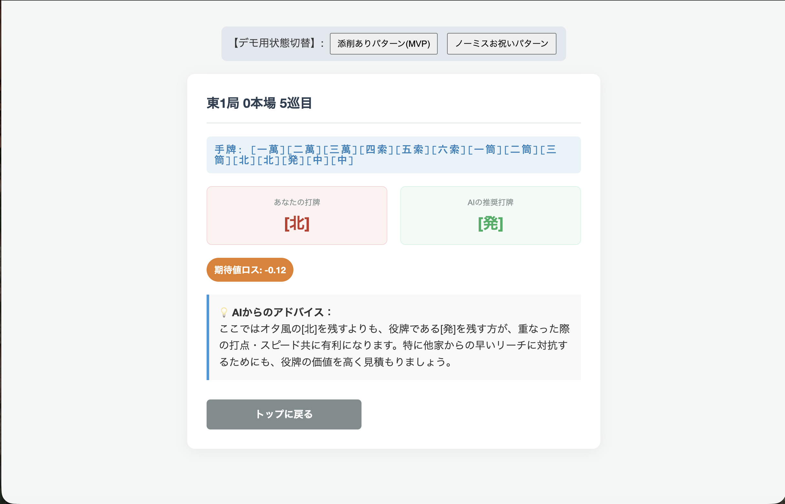

# 📋 要件定義書：出力画面

## 1. 概要（目的とゴール）
* **目的：** ユーザーが入力した牌譜から、AIが判断した「最も致命的な一打（期待値の差が最大の局面）」を提示し、なぜそれがダメだったのか、何が正解だったのかを分かりやすく解説すること。
* **ゴール：** ユーザーが自身の最大の弱点を一目で理解し、次の対局に活かせる具体的なアドバイスを持ち帰れる状態を作る。

## 2. ユーザー体験（UX）とユースケース
* **想定される流れ：**
  1. 入力画面から遷移し、ローディングが明けると本画面（出力画面）が表示される。
  2. 画面上部で、対象の局面（東〇局など）と、手牌・河の状況を視覚的に確認する。
  3. 自分の打牌とAIの推奨打牌（最適解）の比較、および期待値（q_value）の差を確認する。
  4. 画面中央〜下部で、LLMによる「なぜ自分の打牌がダメだったのかの理由」と「改善のアドバイス」を読み、納得する。
  5. 画面最下部のボタンから、いつでも「トップ（入力画面）に戻る」ことができる。

## 3. 機能要件（フロントエンド担当）
### 3.1 表示項目（画面に載せるもの）
* [ ] **局面ヘッダー：** 対象の局情報（例：東1局 0本場 5巡目）
* [ ] **局面ビジュアルエリア（優先度：中）：**
  * ※MVPではテキストベース（例：手牌 `[一索][二索][三索]...`）で実装。
  * ただし、画像・イラストにいつでも差し替えられるよう、コンポーネント（部品）の枠組みだけ作っておく。
* [ ] **打牌比較コンポーネント：** 「あなたの打牌」vs「AIの推奨打牌（最適解）」を並べて表示。
* [ ] **期待値差分表示（q_value）：** 得点期待値のマイナス幅（例：`期待値ロス: -0.12`）を強調表示。
* [ ] **LLM解説文章表示エリア：** 「なぜダメなのかの理由」と「アドバイス」を読みやすいフォントサイズで表示。
* [ ] **将来用・複数局面切り替えスペース（※MVPでは非表示/ダミー）：**
  * ※将来的に「1局目」「2局目」と切り替えるための「サイドバー（画面左側）」または「画面上部のタブ」のスペースをあらかじめレイアウト設計で確保（空けて）しておく。MVPではここを非表示にする。
* [ ] **トップに戻るボタン：** 画面の最下部（フッターの上）に配置。

### 3.2 入力仕様とバリデーション
* 出力画面のため、ユーザーによるテキスト入力はなし（基本は閲覧のみ）。

### 3.3 データ表示・表現形式
* **表示の粒度：** MVPでは、1つの牌譜につき「最も得点期待値の差が大きい1局面」のみを厳選して表示する。

## 4. 非機能要件・エラーハンドリング
### 4.1 エラーケースの定義
* [ ] **データ空エラー（ノーミス時の特殊表示）：**
  * ※AIの最適解とユーザーの打牌が完全に一致（ミスがゼロ）だった場合、解説エリアの代わりに「素晴らしい！完璧な対局でした！」というお祝いメッセージを画面中央に大きく表示する。この時、トップに戻るボタンも合わせて表示する。
* [ ] **データパースエラー：** バックエンドから返ってきたJSONデータの形式が崩れていて画面が描画できない場合、エラー画面を表示し、トップへの誘導リンクを設置する。

### 4.2 状態（ステート）の定義
* [ ] **初期状態 / 描画中：** ローディング画面からデータを受け取り次第、フェードイン等で滑らかに表示する。

## 5. バックエンド・LLM側への要望（I/F要件）
* **画面表示のためにバックエンドから受け取るデータ：**
  * [ ] 対象の局情報（東/南、局数、本場、巡目）
  * [ ] ユーザーの実際の打牌（例：`"7m"`）と、その時のq_value
  * [ ] AIの推奨打牌（例：`"5m"`）と、その時のq_value（最適解）
  * [ ] 手牌データ（例：`["1s", "2s", "3s", ...]` のような配列。テキスト表示・画像表示どちらにも対応できるようにしておく）
  * [ ] LLMが生成した解説文章（理由とアドバイス）

  
